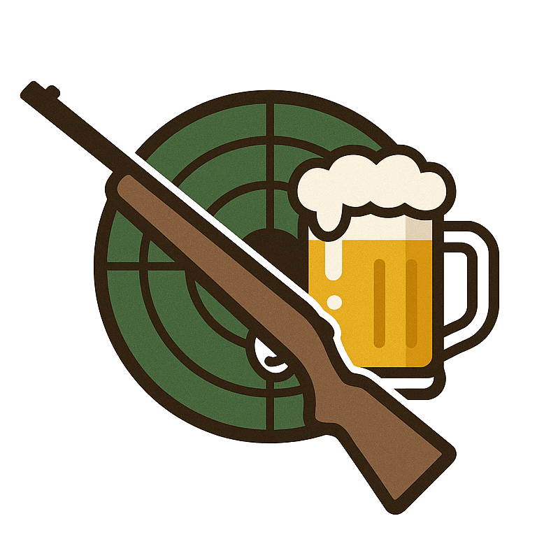

# SchnapsSchuss

  

## 🚀 Features

✅ Manage guests, members, board and treasurer 
✅ book food, drinks, ammunition, disciplines and other items 
✅ Record participants on training days 
🔜 View and export training expenses and income 

## Getting started

At startup an empty database ith a test admin user is created

Credentials
- Username: `admin`
- Password: `admin`

## Resources
- Planning Board with Mockups: [Excalidraw]( https://excalidraw.com/#json=Xeb6Aqymx_deChKCwEXD_,pqo7DiDAvqjdeWJtDU3C9A)
- Planning Documentation [Google Docs](https://docs.google.com/document/d/1jq0N7VE2j1-oZASSKbfZlRn5sMVbrB8SgKh2QU5J0Ts/edit?tab=t.0#heading=h.s3fr9qw9sg3)
